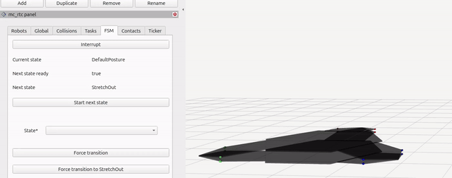

Robogami module mc_rtc FSM controller
================

## Build
```
mkdir -p build
cd build
cmake ../ -DCMAKE_BUILD_TYPE=RelWithDebInfo
make
sudo make install
```

## Configure
Modify the mc_rtc configuration file `$INSTALL_PREFIX/etc/mc_rtc.yaml` so that is uses the Robogami robot and newly installed RobogamiController:
```
MainRobot: robogami
Enabled: RobogamiController
```

## Run

Terminal 1
```
ros2 launch mc_rtc_ticker display.launch
```

Terminal 2
```
mc_rtc_ticker
```



## Reference

`RobogamiController` is a basis for a Robogami module control presented in the following manuscript:

```
@article{mete2026reconfiguration,
  title={Reconfiguration of supernumerary robotic limbs for human augmentation},
  author={Mustafa Mete and Anastasia Bolotnikova and Alexander Schuessler and Jamie Paik},
  journal={arXiv preprint arXiv:2603.29808},
  year={2026}
}

```

